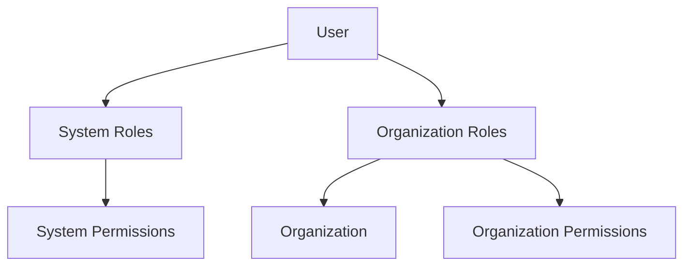

# Database Schema

This document provides comprehensive documentation for the database schema and data models used in q-server.

## Table of Contents

- [Overview](#overview)
- [Core Models](#core-models)
- [Change Log Models](#change-log-models)
- [Schema Architecture](#schema-architecture)
- [Relationships](#relationships)
- [Data Types](#data-types)
- [Indexing Strategy](#indexing-strategy)

## Overview

The application uses a modular Prisma schema approach with MongoDB as the database. Schema files are organized by domain and automatically aggregated during the build process.

### Schema Organization

```
schema/
├── base.prisma                # Base configuration and generator settings
├── user.prisma                # User model and related types
├── role.prisma                # Role model and permissions
├── organization.prisma        # Organization model and theming
├── user-login-session.prisma  # Authentication session management
├── analytics.prisma           # Analytics tracking and statistics
├── email-log.prisma           # Email logging models
└── error-log.prisma           # Error logging models
```

## Core Models

### User Model

The central user model supporting both system and organization users with comprehensive RBAC integration.

```prisma
enum UserCategory {
  SYSTEM        // Global platform access
  ORGANIZATION  // Organization-specific access
}

type TUserPreferences {
  language  String?  // User's preferred language (en, nl)
  themeMode String?  // User's preferred theme (light, dark)
}

type TRBAC {
  organizationId String   @db.ObjectId  // Organization reference
  roleIds        String[] @db.ObjectId  // Assigned role IDs
}

model User {
  id                String            @id @default(auto()) @map("_id") @db.ObjectId
  email             String            @unique
  name              String?
  category          UserCategory      @default(ORGANIZATION)
  rbacGlobalRoleIds String[]          @db.ObjectId  // System-level roles
  rbacOrganizations TRBAC[]                        // Organization-level roles
  lastLoggedInOn    DateTime?
  preferences       TUserPreferences?
  createdAt         DateTime          @default(now())
  createdBy         String            @db.ObjectId
  updatedAt         DateTime?
  updatedBy         String?           @db.ObjectId
}
```

**Key Features:**

- **Unique Email**: Enforced uniqueness across the platform
- **User Categories**: System vs Organization user classification
- **Multi-level RBAC**: Both global and organization-specific roles
- **Preferences**: Personalization settings for language and theme
- **Audit Fields**: Creation and modification tracking

### Role Model

Flexible role system supporting both system-wide and organization-specific roles.

```prisma
model Role {
  id             String    @id @default(auto()) @map("_id") @db.ObjectId
  organizationId String?   @db.ObjectId  // null = system role, non-null = org role
  name           String
  description    String?
  permissionKeys String[]  // Array of permission identifiers
  createdAt      DateTime  @default(now())
  createdBy      String    @db.ObjectId
  updatedAt      DateTime?
  updatedBy      String?   @db.ObjectId
}
```

**Key Features:**

- **Dual Scope**: System roles (organizationId = null) and organization roles
- **Flexible Permissions**: Array-based permission storage
- **Descriptive**: Name and optional description for clarity

### Organization Model

Multi-tenant organization support with custom theming capabilities.

```prisma
type TColors {
  primary           String?  // Primary brand color
  primaryForeground String?  // Text color on primary background
  link              String?  // Link color
}

type TThemeVariables {
  colors TColors?
}

type TTheme {
  light TThemeVariables?  // Light theme configuration
  dark  TThemeVariables?  // Dark theme configuration
}

model Organization {
  id             String    @id @default(auto()) @map("_id") @db.ObjectId
  name           String
  code           String    @unique  // URL-friendly unique identifier
  theme          TTheme?   // Custom theming configuration
  email          String?   // Organization contact email
  permissionKeys String[]  // Available permissions for this organization
  createdAt      DateTime  @default(now())
  createdBy      String    @db.ObjectId
  updatedAt      DateTime?
  updatedBy      String?   @db.ObjectId
}
```

**Key Features:**

- **Unique Code**: URL-friendly organization identifier
- **Custom Theming**: Light/dark theme support with custom colors
- **Permission Scoping**: Organization-specific available permissions
- **Contact Information**: Optional organization email

### UserLoginSession Model

Secure OTP-based authentication session management.

```prisma
model UserLoginSession {
  id        String    @id @default(auto()) @map("_id") @db.ObjectId
  userId    String    @db.ObjectId  // Reference to User
  otp       String    // Hashed OTP for security
  createdAt DateTime  @default(now())
  createdBy String    @db.ObjectId
  updatedAt DateTime?
  updatedBy String?   @db.ObjectId
}
```

**Key Features:**

- **Secure OTP Storage**: OTPs are hashed before storage
- **User Association**: Linked to specific user account
- **Expiration**: Uses createdAt + configurable timeout for expiration

### Error Logging Models

Comprehensive error logging for both API and UI errors.

```prisma
model ApiErrorLog {
  id            String   @id @default(auto()) @map("_id") @db.ObjectId
  statusCode    Int      // HTTP status code
  errorMessage  String?  // Error message
  errorStack    String?  // Full stack trace
  url           String?  // Request URL
  requestBody   String?  // Request payload (sanitized)
  requestMethod String?  // HTTP method
  requestMode   String?  // Request mode
  requestText   String?  // Additional request context
  userId        String?  // User who triggered the error
  createdAt     DateTime @default(now())
  createdBy     String?  @db.ObjectId
}

model UiErrorLog {
  id                  String   @id @default(auto()) @map("_id") @db.ObjectId
  errorMessage        String?  // Error message
  errorName           String?  // Error name/type
  errorStack          String?  // Stack trace
  errorComponentStack String?  // React component stack
  errorDigest         String?  // Error digest/hash
  url                 String?  // Page URL where error occurred
  userId              String?  // User who experienced the error
  createdAt           DateTime @default(now())
  createdBy           String?  @db.ObjectId
}
```

**Key Features:**

- **Comprehensive Context**: Full request/response context for debugging
- **User Association**: Track which user experienced the error
- **Security**: Sensitive data sanitized before logging

### Analytics Models

Comprehensive analytics system for tracking user behavior and application usage with aggregated statistics.

```prisma
model Analytics {
  id             String   @id @default(auto()) @map("_id") @db.ObjectId
  view           String   // Hierarchical view identifier (e.g., "dashboard.users.list")
  parentView     String   // Parent view for hierarchical tracking
  event          String   // Event type (view, click, submit, etc.)
  label          String?  // Optional event label
  metadata       Json?    // Custom event data
  userAgent      String?  // Browser user agent
  url            String?  // Page URL
  ip             String?  // Client IP address
  language       String   // User language preference
  userId         String?  // Associated user (if authenticated)
  organizationId String?  // Associated organization
  createdAt      DateTime @default(now())
  createdBy      String?  @db.ObjectId
}

// Aggregated statistics models for performance
model AnalyticsHourlyOrgStats {
  id             String   @id @default(auto()) @map("_id") @db.ObjectId
  organizationId String   // Organization reference
  hour           DateTime // Hour timestamp
  view           String   // View identifier
  event          String   // Event type
  count          Int      @default(0) // Event count
  createdAt      DateTime @default(now())
  updatedAt      DateTime @updatedAt
}

model AnalyticsDailyOrgStats {
  id             String   @id @default(auto()) @map("_id") @db.ObjectId
  organizationId String
  day            DateTime
  view           String
  event          String
  count          Int      @default(0)
  createdAt      DateTime @default(now())
  updatedAt      DateTime @updatedAt
}

model AnalyticsMonthlyOrgStats {
  id             String   @id @default(auto()) @map("_id") @db.ObjectId
  organizationId String
  month          DateTime
  view           String
  event          String
  count          Int      @default(0)
  createdAt      DateTime @default(now())
  updatedAt      DateTime @updatedAt
}
```

**Key Features:**

- **Event Tracking**: Comprehensive user interaction logging
- **Hierarchical Views**: Parent-child view relationship tracking
- **Flexible Metadata**: JSON storage for custom event data
- **Privacy Aware**: Optional user and IP tracking
- **Multi-tenant**: Organization-specific analytics
- **Performance Optimized**: Pre-aggregated statistics by hour/day/month
- **User Analytics**: Individual user behavior tracking with separate stats models

## Change Log Models

Complete audit trail system with change log tables for all core models.

### UserChangeLog

```prisma
model UserChangeLog {
  id                String            @id @default(auto()) @map("_id") @db.ObjectId
  userId            String            @db.ObjectId  // Reference to original user
  email             String?
  name              String?
  category          UserCategory
  rbacGlobalRoleIds String[]          @db.ObjectId
  rbacOrganizations TRBAC[]
  lastLoggedInOn    DateTime?
  preferences       TUserPreferences?
  createdAt         DateTime?         // Original creation time
  createdBy         String?           @db.ObjectId
  updatedAt         DateTime?         // Original update time
  updatedBy         String?           @db.ObjectId
  archivedAt        DateTime?         // When this change was archived
  archivedBy        String?           @db.ObjectId  // Who archived this change
}
```

### RoleChangeLog

```prisma
model RoleChangeLog {
  id             String    @id @default(auto()) @map("_id") @db.ObjectId
  roleId         String    @db.ObjectId  // Reference to original role
  organizationId String?   @db.ObjectId
  name           String?
  description    String?
  permissionKeys String[]
  createdAt      DateTime?
  createdBy      String?   @db.ObjectId
  updatedAt      DateTime?
  updatedBy      String?   @db.ObjectId
  archivedAt     DateTime?
  archivedBy     String?   @db.ObjectId
}
```

### OrganizationChangeLog

```prisma
model OrganizationChangeLog {
  id             String    @id @default(auto()) @map("_id") @db.ObjectId
  organizationId String    @db.ObjectId  // Reference to original organization
  name           String
  code           String
  theme          TTheme?
  email          String?
  permissionKeys String[]
  createdAt      DateTime?
  createdBy      String?   @db.ObjectId
  updatedAt      DateTime?
  updatedBy      String?   @db.ObjectId
  archivedAt     DateTime?
  archivedBy     String?   @db.ObjectId
}
```

**Change Log Features:**

- **Complete History**: Full snapshot of object state at time of change
- **Audit Trail**: Who made changes and when
- **Data Integrity**: Preserve historical data even after original deletion

## Schema Architecture

### Modular Design

The schema is split into logical modules for maintainability:

1. **base.prisma**: Database configuration and generator settings
2. **Domain-specific files**: Each major entity in its own file
3. **Automatic aggregation**: Build process combines files into single schema

### Build Process

```typescript
// scripts/aggregate-prisma-schema.ts
// Combines all .prisma files into single schema.prisma
```

### Type Safety

- **Generated Types**: Prisma generates TypeScript types for all models
- **Runtime Validation**: Zod schemas for request validation
- **Custom Types**: Embedded types for complex data structures

## Relationships

### User-Role Relationships



### Organization Hierarchy

- **Organizations**: Independent tenants
- **Users**: Can belong to multiple organizations with different roles
- **Roles**: Scoped to either system or specific organization
- **Permissions**: Inherited through role assignments

## Data Types

### MongoDB-Specific Types

- **ObjectId**: Primary keys and references (`@db.ObjectId`)
- **Arrays**: Permission lists, role arrays
- **Embedded Objects**: Themes, preferences, RBAC mappings

### Custom Types

- **TUserPreferences**: User personalization settings
- **TRBAC**: Organization-role mapping structure
- **TTheme**: Comprehensive theming system
- **TColors**: Color palette definitions

## Indexing Strategy

### Primary Indexes

- **\_id**: Default MongoDB ObjectId index on all collections
- **Unique fields**: email (User), code (Organization)

### Performance Indexes

Recommended indexes for optimal performance:

```javascript
// Users collection
db.User.createIndex({ email: 1 });
db.User.createIndex({ category: 1 });
db.User.createIndex({ rbacGlobalRoleIds: 1 });
db.User.createIndex({ 'rbacOrganizations.organizationId': 1 });

// Roles collection
db.Role.createIndex({ organizationId: 1 });
db.Role.createIndex({ permissionKeys: 1 });

// Organizations collection
db.Organization.createIndex({ code: 1 });

// Analytics collection
db.Analytics.createIndex({ createdAt: -1 });
db.Analytics.createIndex({ view: 1 });
db.Analytics.createIndex({ event: 1 });
db.Analytics.createIndex({ parentView: 1 });
db.Analytics.createIndex({ organizationId: 1 });
db.Analytics.createIndex({ createdAt: -1, view: 1 });
db.Analytics.createIndex({ createdAt: -1, event: 1 });
db.Analytics.createIndex({ organizationId: 1, createdAt: -1 });

// Analytics statistics collections
db.AnalyticsHourlyOrgStats.createIndex({ organizationId: 1, hour: -1 });
db.AnalyticsDailyOrgStats.createIndex({ organizationId: 1, day: -1 });
db.AnalyticsMonthlyOrgStats.createIndex({ organizationId: 1, month: -1 });

// Error logs
db.ApiErrorLog.createIndex({ createdAt: -1 });
db.ApiErrorLog.createIndex({ userId: 1 });
db.UiErrorLog.createIndex({ createdAt: -1 });
```

### Query Optimization

- **Compound indexes** for frequently combined queries
- **TTL indexes** for automatic cleanup of expired sessions
- **Sparse indexes** for optional fields

## Security Considerations

### Data Protection

- **Sensitive Fields**: OTPs hashed before storage
- **Request Sanitization**: Sensitive request data removed from logs
- **Permission Isolation**: Organization data completely isolated

### Audit Trail

- **Complete History**: All changes tracked in change log tables
- **User Attribution**: Every change attributed to specific user
- **Timestamp Accuracy**: Precise timing of all operations

### Best Practices

1. **Regular Backups**: Automated backup strategy for all collections
2. **Index Monitoring**: Regular performance analysis of queries
3. **Data Retention**: Policies for log cleanup and archival
4. **Access Control**: Database-level access restrictions
5. **Encryption**: Data encryption at rest and in transit

## Migration Strategy

### Schema Evolution

- **Prisma Migrations**: Version-controlled schema changes
- **Backward Compatibility**: Careful handling of breaking changes
- **Data Migration**: Scripts for complex data transformations

### Deployment Process

1. **Schema Validation**: Prisma validates schema changes
2. **Migration Generation**: Automatic migration script creation
3. **Testing**: Migration testing in staging environment
4. **Production Deployment**: Controlled rollout with rollback plan
